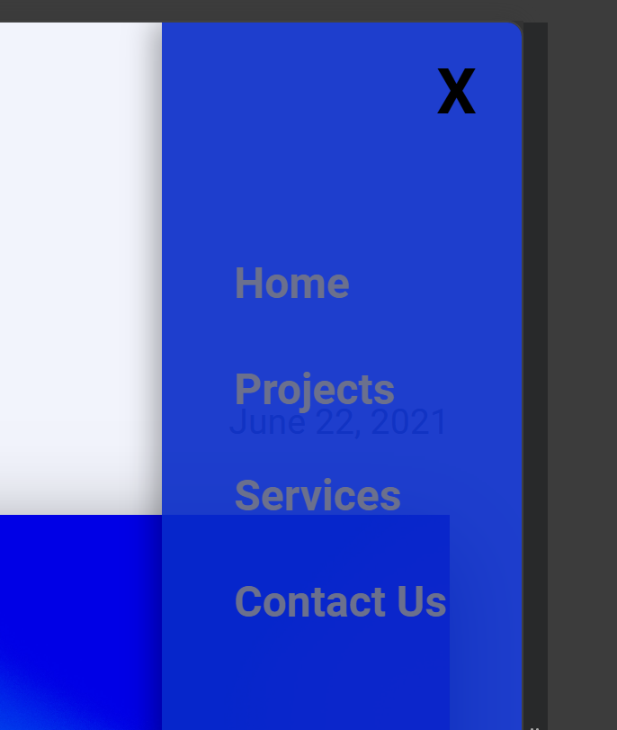
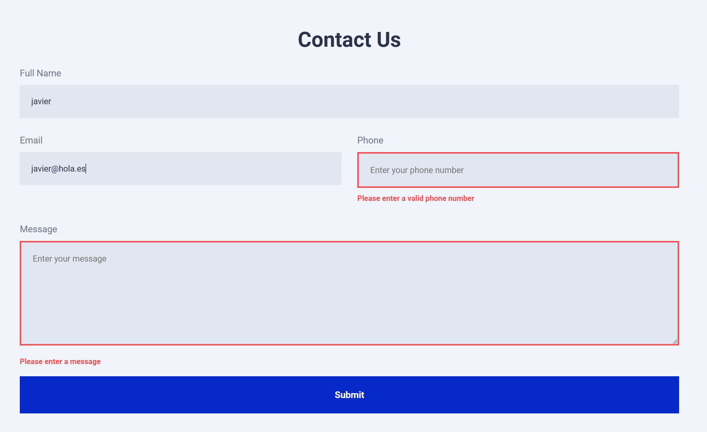
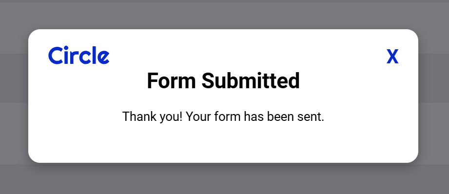

# Circle Agency Web

Responsive multi-page website built with HTML, CSS and JavaScript, based on a Figma design.  
Includes dynamic content, interactivity, and deployment using Netlify.

- Figma design: https://www.figma.com/design/hJWUISjsXRdZ8fG453x6L9
- Live WEB Site: https://project1-circleweb.netlify.app/

---

## Project Overview

This project simulates a real-world workflow for a digital agency website.

Pages included:

- Home
- Projects (dynamic content from API)
- Contact (form with validation)


---

## Technologies

- Visual Studio Code
- HTML5
- CSS3 
- JavaScript
- Git & GitHub
- Netlify
- Gemini IA / ChatGPT / Claude

---

## Features

- Fully responsive design (mobile-first)
- Dynamic project loading from API
- URL-based project navigation
- Contact form validation
- Mobile hamburger menu
- Scroll-to-top button

---

## Project Structure
```js
CIRCLE-AGENCY-WEB/
│
├── CSS/
│ ├── style.css
│ ├── index.css
│ ├── projects.css
│ ├── contact.css
│ ├── burger.css
│ ├── arrow-scroll.css
│ ├── responsive.css
│
├── Scripts/
│ ├── index.js
│ ├── projects.js
│ ├── contact.js
│ ├── arrow-scroll.js
│
├── images/
├── index.html
├── projects.html
├── contact.html
└── README.md
```

---

## JavaScript Overview

### API & Data Handling

- Fetch projects from external API
- Extract `id` from URL using `URLSearchParams`
- Render content dynamically

```js
    // Obtenemos el ID de la URL con URLSearchParams
    const params = new URLSearchParams(window.location.search);
    let queryId = params.get('id');
```

## DOM & Interactions

- Hamburger menu toggle (mobile)
- Scroll-to-top button with smooth scroll
- Dynamic rendering using `innerHTML`
```js
// DOM with .textContent
function renderMainProject(project) {
    if (!project) return;
    
    // Select items from <section id="project">
    document.querySelector('#project .title').textContent = project.name;
    document.querySelector('#project .project-subtitle').textContent = project.description;
    document.querySelector('#project .project-date').textContent = project.completed_on;
    document.querySelector('#project .project-image img').src = project.image;
    document.querySelector('#project article').innerHTML = project.content;
};

// DOM with .innerHTML at the section "Other Projects"
function renderOtherProjects(others) {
    const container = document.querySelector('#projects .project-contaier');
    container.innerHTML = ''; // clean content

    // three projects
    others.slice(0, 3).forEach(p => {
        container.innerHTML += `
            <article>
                <a href="projects.html?id=${p.uuid}">
                    
                    <h4>${p.name}</h4>
                    <p>${p.description}</p>
                    <span class="learn-more">Learn more</span>
                </a>
            </article>
        `;
    });
};

```


---

## Form Validation

- Uses `FormData` to collect inputs
- Validates empty fields
- Adds visual feedback with CSS classes
- Displays success modal

---

## Key UI Components

### Scroll-to-top button

- Built with pure CSS
- Appears after scrolling
- Smooth scroll behavior

<p align="center">
  
</p>

---

### Mobile menu

- Hidden on desktop
- Slide-in menu with CSS + JS
- Click outside to close

<p align="center">
  
</p>

---

### Contact form + modal

- Input validation
- Error messages
- Success modal

<p align="center">
    <br>
  
</p>

---

### Hero section

- Layered images with CSS positioning
- Responsive simplification on mobile

<p align="center">
  
</p>


## Challenges

- Syncing API data with URL parameters
- Managing responsive navigation
- Handling form validation dynamically


## Improvements

- Add loading states for API
- Improve accessibility
- Refactor JS into modules
- Add animations


## Author

Javier Barroso Romero

## License

Educational project